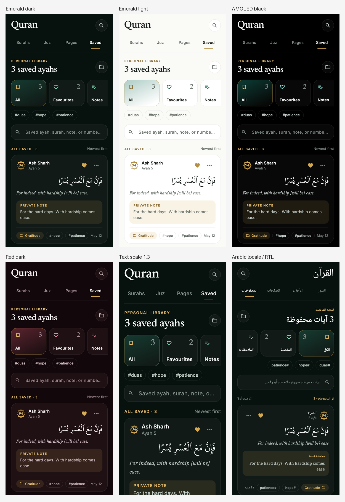

# Phase 2: Quran Saved tab

Branch `redesign/p2-saved` starts at updated beta `6bbc389`, after Phase 1 PR #94
merged. This phase changes only Saved presentation and its parent-tab callbacks.
Repositories, models, bookmark rules, ordering, Quran text selection and reader
navigation remain unchanged.

## Changed surfaces

- `lib/widgets/favourites_list.dart`: collections rail, tag filters, search,
  hairline verse cards, empty state, editor and folder-dialog lifecycle.
- `lib/home/main_page.dart`: Saved-only Quran heading/tabs, search focus, and
  Browse surahs callback. The other tabs retain their existing presentation.
- `pubspec.yaml` and `assets/media/fonts/noto-naskh-arabic/`: bundle the existing
  Arabic interface family for Saved labels. Inter and Newsreader use Phase 1
  assets. Quran Arabic continues to use the user's existing font selection.
- `lib/l10n/`: four strings and generated delegates, synchronized across all
  eight locales. Non-English additions are machine translations needing review.
- `lib/debug/saved_preview_main.dart`: isolated sample preview, absent from
  production navigation. It uses the real Saved widgets and bookmark service.
- `test/redesign/saved_tab_test.dart`: service-backed UI/integration tests and
  21 golden screenshots, with temporary in-memory Hive boxes.

## Verification

All **171 tests passed**, including 17 Saved tests. Static analysis reports
**No issues found**. Dependency policy and eight-locale consistency checks pass.
`dart format .` formats 235 files with zero changes. The formatter still reports
an existing unresolved `very_good_analysis` include in excluded `third_party/foil`;
it does not produce an analyzer finding. Localization regeneration is stable.
`pubspec.lock` is unchanged and tracked.

The Saved tests cover collection/folder/tag filter toggles, the existing search
fields, clearing search, favourites with metadata retention, all overflow actions,
notes/folder/tags save, removable tag pills, editor favourite and delete,
confirmation cancel/remove, folder creation/rename/delete, reader chapter/ayah,
empty copy and Browse callback, and the actual MainPage search/Browse integration.
Controller disposal belongs to the sheet/dialog widgets, so closing transitions
cannot use a disposed controller.

Library, editor and empty state goldens use 390 logical px × 844, captured at 3×,
for emerald-dark, emerald-light, AMOLED black, red-dark, text scale 1.3, Arabic RTL,
and Arabic RTL with text scale 1.3. Palette values come from the existing source
colors and EquranTokens. The existing Phase 0 tests cover all 11 token palettes.
The standalone web preview was also inspected at 390px.



Individual captures are in [test/redesign/goldens/saved](../../test/redesign/goldens/saved/).
The [dark editor](../../test/redesign/goldens/saved/emerald-dark-sheet.png),
[dark empty state](../../test/redesign/goldens/saved/emerald-dark-empty.png), and
[Arabic at 1.3](../../test/redesign/goldens/saved/arabic-text-1.3-library.png)
provide additional views.

## Preview differences and limits

- The native Quran font selection is retained rather than replacing it with the
  preview's Amiri. List cards show complete Arabic and selected translations;
  real long ayahs therefore make taller cards than the HTML sample excerpts.
  The editor retains its existing three-line Arabic excerpt.
- Empty copy remains `saveAyahsNotesHere` and `savedAyahLibraryHint`, as required.
  Collections and search remain available for empty/filter states. This adds
  height compared with the shorter static empty specimen; Browse is scrollable.
- The editor keeps an editable comma-separated tag field as well as removable
  pills. It shows all real folders, including Unsorted, and keeps folder creation
  and management. Those rows can wrap and grow compared with the static sample.
- Tiles preserve 128 × 96 at scale 1 and grow vertically at larger scales. All
  text and editor content can grow/scroll for accessibility. Arabic interface
  labels use bundled Noto Naskh Arabic rather than Newsreader, which has no
  Arabic glyphs; English display type stays Newsreader.
- The existing global bottom navigation is unchanged. Screenshots isolate the
  actual Saved widgets and header without global navigation or an OS status bar;
  production uses SafeArea. No other page or redesign phase is restyled.
- Browser policy prevented opening the local HTML reference previews. Their
  inline CSS was inspected for measurements, colors and section order; the
  implementation and screenshot comparison use that source. A direct rendered
  HTML side-by-side comparison was unavailable.

## Local preview

```sh
flutter run -d web-server --web-port 8134 --web-hostname 127.0.0.1 \
  --no-pub -t lib/debug/saved_preview_main.dart
```

Optional query parameters: `palette=emerald-light|black-dark|red-dark`, `scale=1.3`,
`locale=ar`, `empty=true`. Use this dedicated debug origin: startup replaces its
sample boxes with deterministic fixtures. It does not start the normal app or
seed the production app's storage.

## Rollback

Revert this phase's commit to restore Saved's previous presentation and remove
its added font registration, strings and preview. No migration or data rollback
is required: the bookmark service and schema are unchanged. Keep the merged
Phase 0/1 tokens, fonts and shared widgets.
