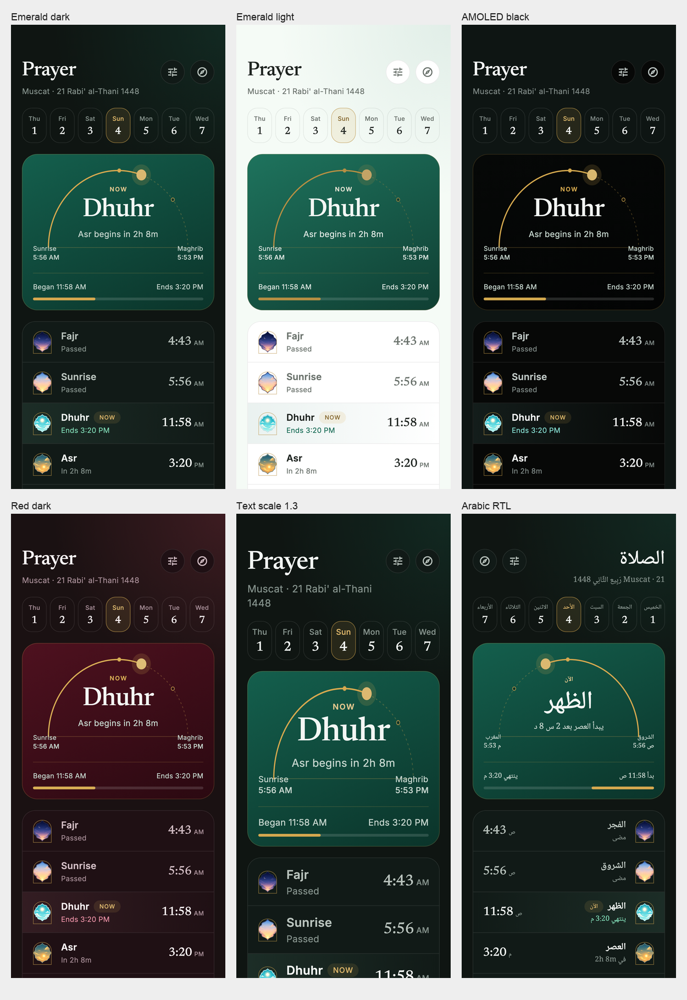
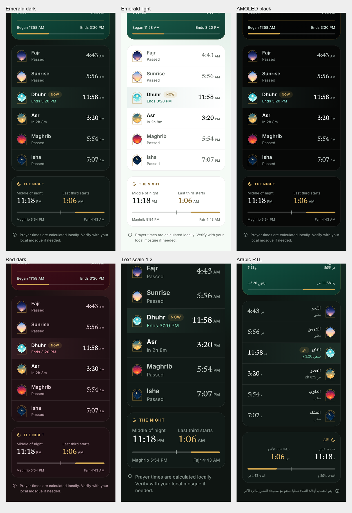

# Phase 4 Prayer — draft, night design pending

Branch: `redesign/p4-prayer`, based on beta after Phase 3 PR #98 merged.

## Implemented

Prayer owns its title, location and localized Hijri caption, settings and Qibla actions. Seven date cells drive the existing date state; the caption and long-press retain the date picker, and Today restores the live date. The daylight hero uses the supplied 342×176 arc geometry, actual elapsed daylight, Dhuhr and Asr markers, existing current-period labels/countdowns and period end. Prayer rows reuse the bundled illustration WebPs through PrayerArch, with a grouped hairline card and compact gold NOW tag. The night-times card keeps the existing middle and last-third calculations. All new decoration is static.

The page changes are in `lib/prayer/prayer_times_page.dart`, `prayer_hero_card.dart` and `prayer_time_thumb_card.dart`, with feature-specific `prayer_arc_hero.dart` and `prayer_clock_text.dart`. Shared additions are page typography and an opt-in compact PillTag. Home's duplicate Prayer app bar is removed; Home's existing prayer cards retain their default appearance. Four strings are added to all eight ARBs and generated localizations. No service, repository, persisted model, database schema or lockfile changes.

## Required owner decision

IMPLEMENTATION.md requires the night state to be designed with the owner. The pending proposal uses the same arc with a moon and elapsed Maghrib→Fajr progress, preserving the existing next-prayer countdown. Between Fajr and sunrise, the completed moon arc stays until daylight starts. Colors come from existing hero and gold tokens and there is no animation. The alternative is a static moon with countdown and no night progress arc.

Until that choice is answered, the existing nighttime hero is preserved. This is an incomplete Phase 4 draft and must not be merged. Phase 5 has not started.

## Verification and captures

- 390×844 viewport goldens for emerald-dark, emerald-light, AMOLED black, red-dark, text scale 1.3, Arabic RTL, and Arabic RTL at text scale 1.3. Each includes a header/hero and a scrolled list/night-times capture (14 PNGs).
- Production PrayerTimesPage is used by a debug-only preview with isolated Hive settings and deterministic Muscat location/time. The calculated prayer times are real, not copied preview figures.
- Behavior checks cover week selection, Today, date picker, settings from header/hero, Qibla route, daylight endpoints, prohibited-period labels, morning without an invented start time, and preservation of the existing night hero.
- Full test suite passed: 200 tests, including 14 Prayer cases. Static analysis has zero findings. Dependency policy, localization completeness, stable localization generation and whitespace checks passed. Token tests cover all 11 palettes and 13 contrast pairs.
- Formatting reports the pre-existing unresolved `very_good_analysis` include in excluded `third_party/foil` packages; no vendor edits are made. Application analysis has zero findings.

Full-resolution captures, including Arabic at 1.3, are under `test/redesign/goldens/prayer-*.png`.

## Differences retained deliberately

- PrayerDay starts at the preceding Maghrib. Prayer rows and night-times retain that existing Islamic-day data wiring, so at midday the listed Maghrib/Isha have passed. The daylight arc uses the following PrayerDay's Maghrib, on the sunrise's civil date. Altering the list to civil-day times would change the requested existing behavior.
- Existing Morning, Zawal, Sunrise and Sunset/prohibited labels remain. The footer shows a began time/progress only when the service supplies a current prayer, avoiding fabricated starts; date browsing does not show live elapsed progress.
- Week cells use existing localized weekday names, with scaling down for long labels, rather than the English canvas's one-letter labels. Larger text and RTL allow natural growth/wrapping.
- Existing settings and Qibla controls, the date picker and Today remain reachable. Actual times, localized labels and the source illustration assets differ from static placeholders.
- Inline CSS was inspected for sizes/spacing. A browser security restriction prevented rendering the local HTML reference directly; Flutter captures were visually checked against that CSS, so a browser-rendered pixel comparison is unverified.

## Migration and rollback

There is no data migration. Reverting this phase's commit restores the previous Prayer presentation and shell app bar. Do not revert it after dependent Phase 5 changes without handling that dependency first. Preview seeds affect only the debug preview's isolated store.
