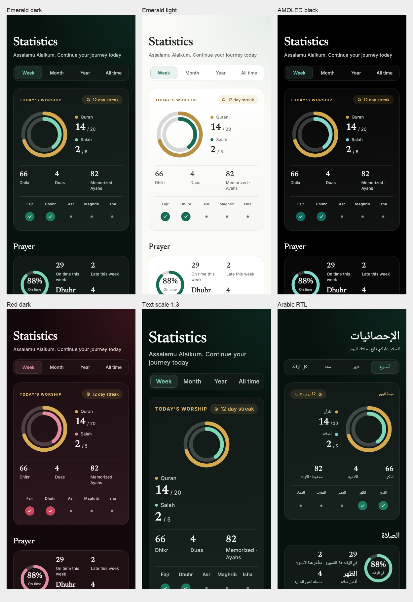
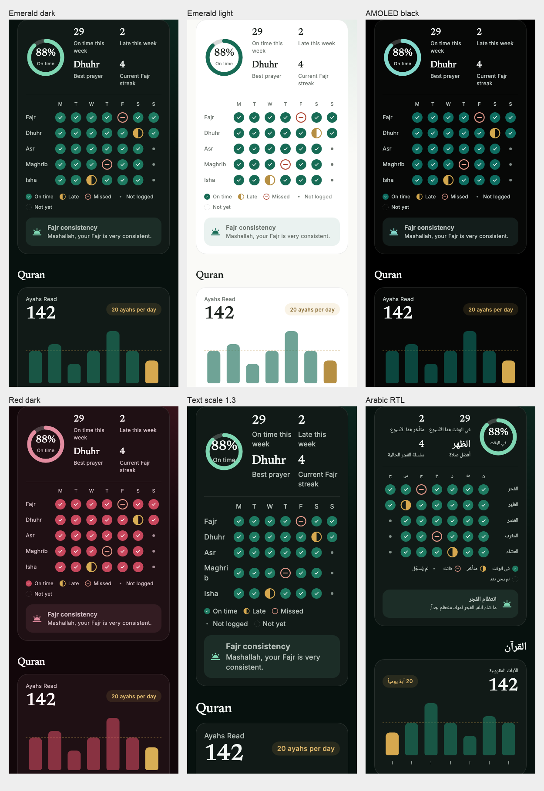
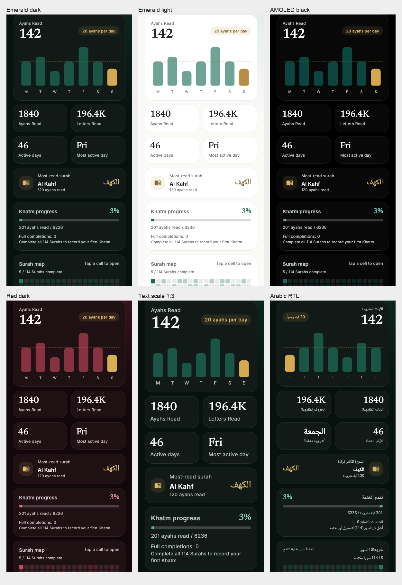
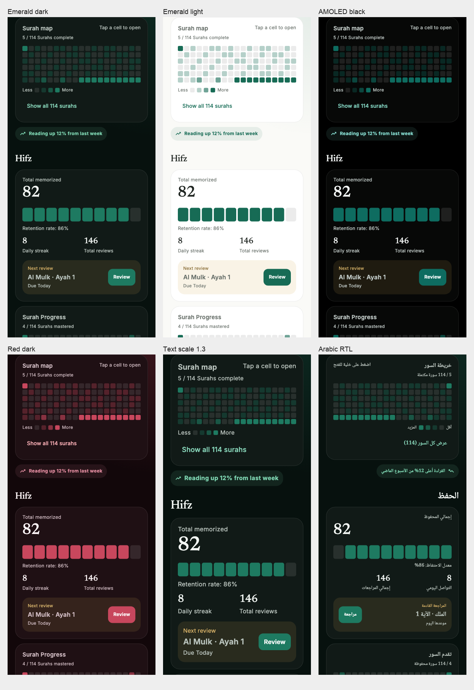
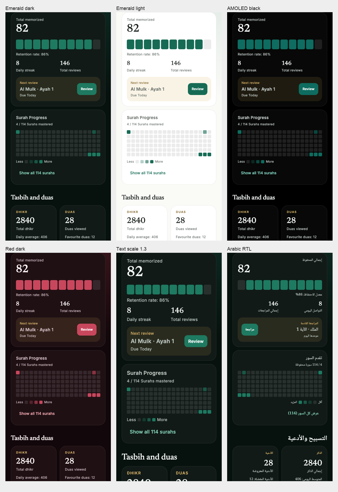
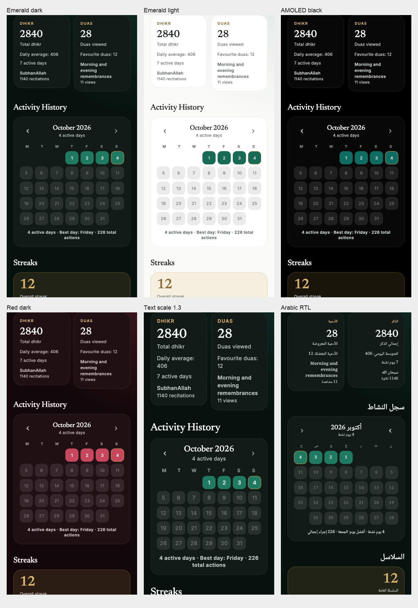
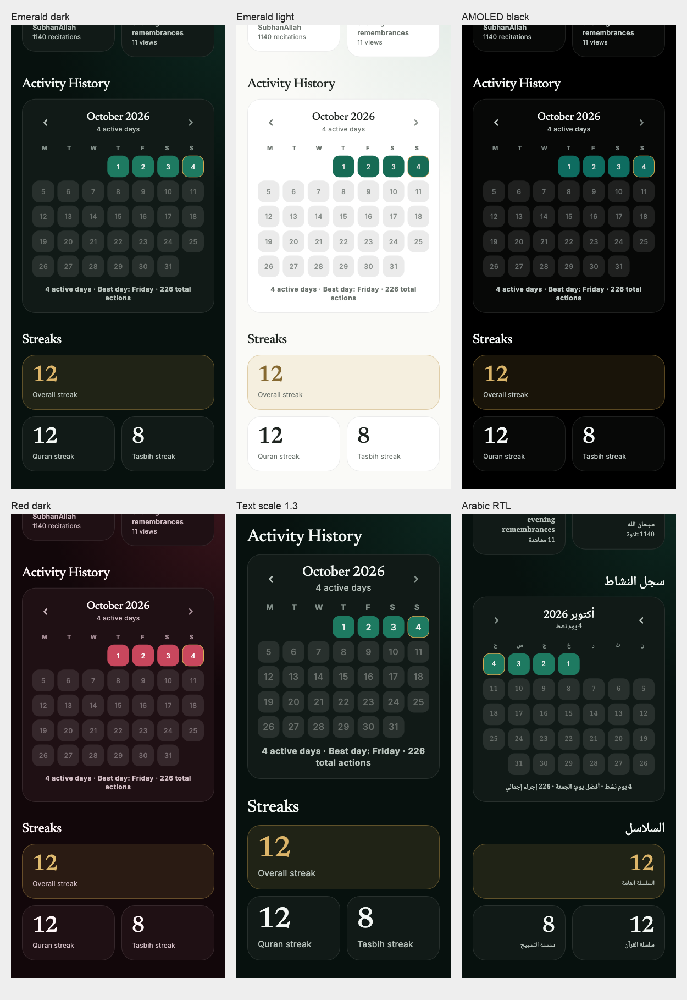

# Phase 5: Statistics verification

Phase 5 branches from beta after the approved Phase 4 moon arc merged. Statistics now has its own Newsreader title, segmented range control, two-ring Today card, in-flow section headings, Prayer glyph matrix, Quran chart and coverage map, Hifz retention/review card, paired Tasbih/Duas cards, calendar and streak cards.

## Scope and data preservation

Presentation changes are in `lib/home/quran_stats_page.dart` and its feature-local presentation part, `lib/home/statistics_redesign.dart`. Home suppresses the duplicate app bar for the Statistics fallback route; the page supplies a back button when pushed. Seven labels were added to all eight ARBs, with generated localizations. Debug fixtures and tests are isolated from the app's normal stores.

The StatisticsRepository, all persisted models and all retained calculations are unchanged. The existing overview, `StatRange`, async section loading, database listeners, prayer-save sanitization, opt-in setting, reading navigation, shared map expansion state, Hifz home navigation, month loading, swipe controls and day-detail sheet remain. The two public decorative painters used by Hifz remain unchanged. Four unused date/quote/color presentation helpers and superseded presentation widgets were removed. No dependency, storage schema, service, lockfile or platform configuration changes.

## Verification

- Required 390×844 captures: emerald-dark, emerald-light, AMOLED black, red-dark, text scale 1.3 and Arabic RTL, plus Arabic RTL at 1.3. There are 56 full-resolution goldens: Today, Prayer, Quran, Quran map, Hifz, Tasbih/Duas, history and streaks for each of seven variants.
- Fifteen Statistics tests cover independent Hifz load failure without disabling Today/logging, all range values, absence of sticky headers, saving prayer status and reactive overview refresh, opt-in/dismiss/re-enable, surah expansion and reading navigation, next-review navigation, month buttons/swipes/day details, Arabic enlarged-text logging with left-to-right count fractions, and the seven visual variants.
- Full test suite: 215 passing tests. Static analysis: zero findings. Dependency policy and localization completeness checks pass. Formatting changes no files. Token and contrast tests cover all 11 palettes.
- The installed formatter still reports the existing unresolved `very_good_analysis` include in excluded `third_party/foil` packages. No vendor changes were made; application analysis is clean.
- The actual Flutter web preview was checked at 390 px, alongside inspection of all captured variants. The reference HTML's inline CSS was read for dimensions/type/colors; the earlier browser restriction on rendering local HTML remains, so a browser-rendered pixel comparison with the reference is unverified.

## Deliberate differences from static sample figures

- All values use existing data. “Memorized · Ayahs” replaces the sample's “Surahs mastered” in Today because `totalMemorized` counts mastered ayah entries. The Hifz map separately retains its complete-surah count.
- Existing weekly on-time/late totals remain explicitly labeled “this week” even when another range is selected; the on-time ring and best prayer retain their selected-range data. The matrix shows the most recent seven days, with existing prayer-time availability distinguishing unlogged from not-yet-available prayers.
- The dashed daily goal line appears for the Week chart's daily buckets. Month, Year and All time retain their original weekly/monthly/yearly buckets without drawing a daily threshold against incompatible units. The daily-goal label remains visible.
- Full-completion dates/counts, Quran insights, completed-surah summaries, Hifz review/streak totals and map, Tasbih average/active days/most-recited detail, and Duas favorites/category detail are retained. Those details add height beyond the simplified canvas.
- Streaks retains overall, Quran and Tasbih current streaks. No “longest streak” value is invented or calculated in a presentation-only phase; the existing model does not provide one.
- Calendar keeps the existing Monday-first data arrangement, month restrictions and details. Colors/type/radii follow the redesign. Arabic and larger text may wrap or stack to remain readable.
- Compact Quran map has 19 columns and all 114 cells; its labeled expansion uses six columns. Every cell opens the existing reader. Hifz review controls retain the existing Hifz home destination.
- The existing navigation dock is unchanged; its restyle is outside this page's phase.
- New non-English labels are machine-drafted and require native-speaker review.

## Captures

Individual captures, including Arabic at 1.3, are in `test/redesign/goldens/statistics-*.png`.

## Migration and rollback

There is no data migration. Revert this phase's commit to restore the earlier Statistics presentation and fallback app bar. Preview seeds run only in the isolated debug entry point; normal app launch uses the unchanged production repository.
