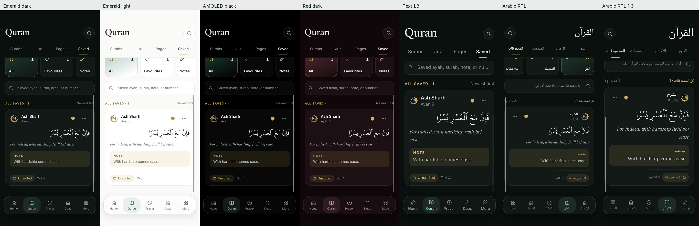
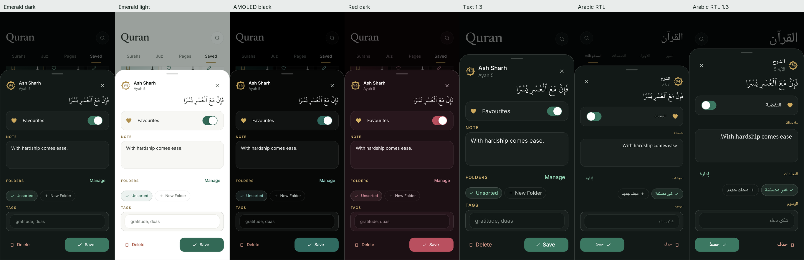
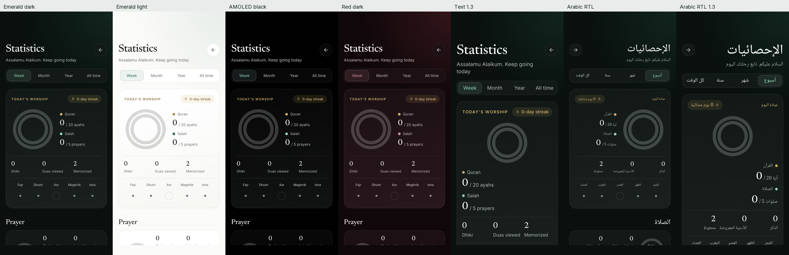
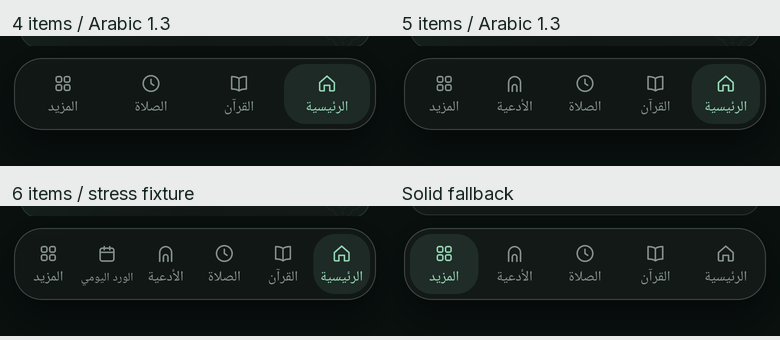

# Round 1: floating dock and labels

Branch `redesign/f1-dock`, based on `origin/beta` at `fba275e`. Scope is only owner-decided items 1–3 in `CODEX_FOLLOWUP.md`.

## Changes

- `home.dart` replaces `_buildBottomNavigation`'s solid NavigationBar with FloatingDock. Items, order, selected index, selection haptics and reselect callback come from the existing NavigationBloc. No bloc, stored-order, promotion/displacement, More customization or TabEntrance changes. The inner Quran tabs in `main_page.dart` are unchanged.
- Dock uses DesignIcon, 14 px side margins, 72 px height, radius 28, 1 px hair2 border, emWash active capsule and 20 px backdrop blur. DeviceCapabilityService disables blur and selects the existing solid surface fallback. Labels fit one line, with scale-down only when their available width requires it; accessible labels stay complete.
- The shell reserves the dock, bottom safe area and 12 px clearance above it for every active destination, including nested floating action buttons.
- Saved verse cards and the Saved editor use the new localized `note` key. All eight ARBs and generated localizations are updated. `privateNote` remains because the reader editor still uses it, outside this Saved-only round.
- Today's statistics reuses `hifzMemorized` (“Memorized”), removing the appended “· Ayahs”. All three labels share one reserved line. The real `totalMemorized` data and repositories are unchanged.

### Icon mapping

| NavItem | DesignIcon |
| --- | --- |
| home / quran / prayer / duas / more | home / quran / clock / arch / grid |
| statistics / qibla / downloads | trophy / compass / folder |
| readingPlans / hifz / tasbih | calendar / book / dotsgrid |
| asmaUlHusna / settings / zakat / calendar | sparkle / sliders / grid / calendar |

## Verification

- `dart format .`: 250 files, zero changes. The formatter emits the existing unresolved `very_good_analysis` include warning for the excluded third_party/foil package; vendor files are unchanged.
- `flutter analyze --fatal-infos`: zero findings.
- `flutter test`: 229 tests pass, including all token/contrast tests and affected golden baselines.
- Dependency policy and localization completeness checks pass. `flutter gen-l10n` is synchronized. No manifest, lockfile, platform, theme-token, repository, model or service change is included.
- Focused dock tests cover 4, 5 and 6 items, both directions, text scale 1.3, label bounds, selection/reselection callback indices, design icons and the solid fallback. The Statistics test checks real fixture memorized counts and equal label alignment.
- **Real native app:** a separate iPhone 13 simulator, iOS 26.5, Flutter 3.44.8. Actual logical viewport is asserted as 390 × 844; captures are native 1170 × 2532 window screenshots, not debug preview renders. The normal `main.dart`, MyApp, startup services, HomePage and feature pages run. Every default tab is tapped and reselected in every condition below. Selected-index and page identity are asserted, as is page clearance above the dock.
- Sample data is confined to this newly created task simulator: Makkah prayer location, one saved note and two mastered ayahs. The Statistics capture shows that actual repository count of two. No debug preview repository supplies the native pages.
- 4/5/6-item native captures use transient test state only. Production NavigationBloc permits 2–5 active items; that rule and persistence are unchanged. Six items is a presentation stress fixture, not a newly enabled customization.
- Native fallback capture sets the capability profile to low RAM and asserts the dock has no BackdropFilter, then restores the profile.

### Native limitation: existing empty Quran card

The strict native run catches a **3 px bottom overflow at text scale 1.3** in the unchanged `EquranResumeImageCard`, `last_read_cards.dart:332`, used by Quran's “Begin with Quran” empty resume card. The issue occurs in both English and Arabic enlarged-text cases. A separate widget check reproduces the same 3 px overflow at 390 px and 1.3 **without any dock**, with the app's existing 0.94 chrome factor. Its source is identical to beta.

This is left unchanged because it is outside the three authorized items. The PR is a draft: native verification is not clean for the entire app. The dock and requested labels pass their checks. The later Arabic/count/fallback run records the exact existing overflow while retaining failures for other errors; four occurrences are recorded in `screenshots/round1/native-check-notes.txt`. The earlier strict English 1.3 run failed on the same baseline error. The full repository widget suite passes; it did not previously cover this real-app empty card case.

Startup also logs the existing device timezone lookup failure for Asia/Muscat; the prayer fixture explicitly supplies Asia/Riyadh for Makkah. The native build emits existing plugin/UIScene adoption notices. Neither subsystem is changed.

## Intentional differences from the previews

1. The HTML pins the dock at y=760 on its artificial 390 × 844 phone. The native dock respects the iPhone's 34 px bottom safe area: y=726, 12 px above that safe area. The content viewport ends 12 px above the dock so nested page controls remain reachable. This conservative shell inset avoids modifying every feature page; scroll content does not pass underneath the dock as it does in the static HTML.
2. Customized items and counts follow the existing bloc instead of the preview's fixed five examples. The closest available design icons are listed above. Long labels scale down to fit one line while retaining their full accessibility text; the default English labels fit at 1.3.
3. Saved card and editor say “Note” per the owner's decision. The static saved-sheet preview still says “Private note”; it is intentionally overridden here.
4. Statistics says “Memorized” and counts mastered ayahs, rather than the preview's sample “Surahs mastered”. Its real two-ayah fixture count is preserved. Existing enlarged-text ring stacking remains; only the three captions are shortened/fitted.
5. Existing differences in other page typography, sample values, reader chrome, note-text direction, and the empty Quran-card overflow are left outside this round. In Arabic the English sample note inherits the existing text direction; CODEX_FOLLOWUP item 9 remains open. No other follow-up item was started.

## Translations

The new `note` translations in **ar, bn, de, fa, id, tr and ur are machine-drafted** and need native-speaker review. English “Note” is the owner's text. No Statistics translation key was added or changed.

## Captures

Full-resolution native originals are preserved as lossless WebP: decoded pixels were checked against the original PNGs before conversion. The contact sheets below are downsampled viewing aids; individual captures retain native resolution. There are 67 native captures: nine views for each of seven variants, plus three item-count fixtures and solid fallback.

| Condition | Home | Quran | Prayer | Duas | More | Saved / Note | Editor | Statistics |
| --- | --- | --- | --- | --- | --- | --- | --- | --- |
| Emerald dark | [View](screenshots/round1/emerald-dark-home.webp) | [View](screenshots/round1/emerald-dark-quran.webp) | [View](screenshots/round1/emerald-dark-prayer.webp) | [View](screenshots/round1/emerald-dark-duas.webp) | [View](screenshots/round1/emerald-dark-more.webp) | [View](screenshots/round1/emerald-dark-note.webp) | [View](screenshots/round1/emerald-dark-note-editor.webp) | [View](screenshots/round1/emerald-dark-statistics.webp) |
| Emerald light | [View](screenshots/round1/emerald-light-home.webp) | [View](screenshots/round1/emerald-light-quran.webp) | [View](screenshots/round1/emerald-light-prayer.webp) | [View](screenshots/round1/emerald-light-duas.webp) | [View](screenshots/round1/emerald-light-more.webp) | [View](screenshots/round1/emerald-light-note.webp) | [View](screenshots/round1/emerald-light-note-editor.webp) | [View](screenshots/round1/emerald-light-statistics.webp) |
| AMOLED black | [View](screenshots/round1/black-dark-home.webp) | [View](screenshots/round1/black-dark-quran.webp) | [View](screenshots/round1/black-dark-prayer.webp) | [View](screenshots/round1/black-dark-duas.webp) | [View](screenshots/round1/black-dark-more.webp) | [View](screenshots/round1/black-dark-note.webp) | [View](screenshots/round1/black-dark-note-editor.webp) | [View](screenshots/round1/black-dark-statistics.webp) |
| Red dark | [View](screenshots/round1/red-dark-home.webp) | [View](screenshots/round1/red-dark-quran.webp) | [View](screenshots/round1/red-dark-prayer.webp) | [View](screenshots/round1/red-dark-duas.webp) | [View](screenshots/round1/red-dark-more.webp) | [View](screenshots/round1/red-dark-note.webp) | [View](screenshots/round1/red-dark-note-editor.webp) | [View](screenshots/round1/red-dark-statistics.webp) |
| Emerald dark, text 1.3 | [View](screenshots/round1/scale-1.3-home.webp) | [View](screenshots/round1/scale-1.3-quran.webp) | [View](screenshots/round1/scale-1.3-prayer.webp) | [View](screenshots/round1/scale-1.3-duas.webp) | [View](screenshots/round1/scale-1.3-more.webp) | [View](screenshots/round1/scale-1.3-note.webp) | [View](screenshots/round1/scale-1.3-note-editor.webp) | [View](screenshots/round1/scale-1.3-statistics.webp) |
| Arabic RTL | [View](screenshots/round1/arabic-home.webp) | [View](screenshots/round1/arabic-quran.webp) | [View](screenshots/round1/arabic-prayer.webp) | [View](screenshots/round1/arabic-duas.webp) | [View](screenshots/round1/arabic-more.webp) | [View](screenshots/round1/arabic-note.webp) | [View](screenshots/round1/arabic-note-editor.webp) | [View](screenshots/round1/arabic-statistics.webp) |
| Arabic RTL, text 1.3 | [View](screenshots/round1/arabic-scale-1.3-home.webp) | [View](screenshots/round1/arabic-scale-1.3-quran.webp) | [View](screenshots/round1/arabic-scale-1.3-prayer.webp) | [View](screenshots/round1/arabic-scale-1.3-duas.webp) | [View](screenshots/round1/arabic-scale-1.3-more.webp) | [View](screenshots/round1/arabic-scale-1.3-note.webp) | [View](screenshots/round1/arabic-scale-1.3-note-editor.webp) | [View](screenshots/round1/arabic-scale-1.3-statistics.webp) |

[All five tabs in every condition](screenshots/round1/tabs-matrix.png).

## Reproducing the native checks

The archived [native test](round1_runtime_test.dart.txt), [host screenshot driver](round1_runtime_driver.dart.txt) and [independent baseline check](round1_baseline_check.dart.txt) preserve the verification method. Copy them to temporary integration_test, test_driver and test folders in a disposable checkout; temporarily add Flutter SDK `integration_test` to dev_dependencies and run pub get. Run the native harness with `flutter drive --driver test_driver/round1_driver.dart --target integration_test/round1_runtime_test.dart -d <390-point simulator> --no-pub`.

This host required temporary generated iOS/CocoaPods/SPM setup targeting iOS 15 for its installed Xcode, including that target on generated Pods. Those local build files and the temporary dependency were restored/excluded after native checks. The manifest and tracked lockfile match beta exactly. Do not include this local build setup in a presentation-only change.

## Migration and rollback

No data migration. Revert this round's commit to restore the NavigationBar and previous captions. Navigation preferences, existing notes and memorization data retain their formats and values.
